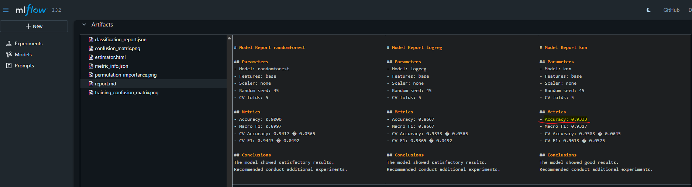
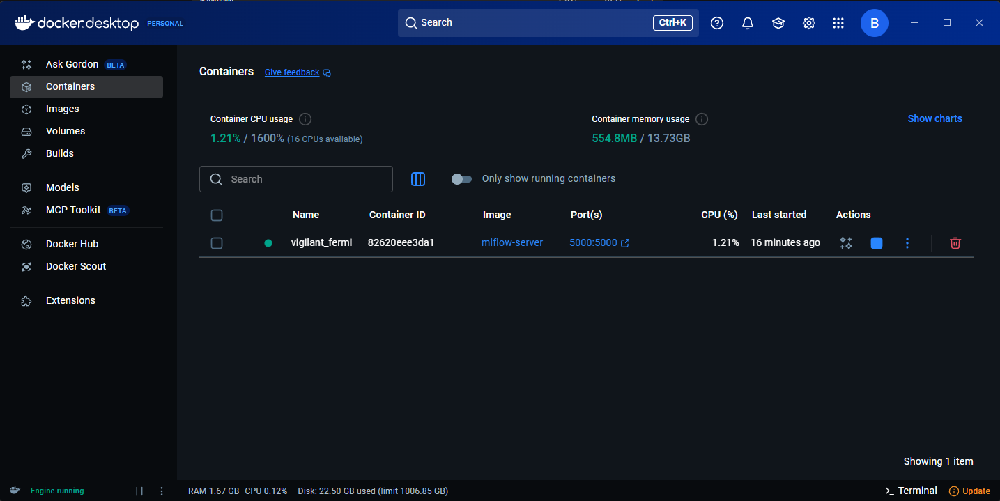
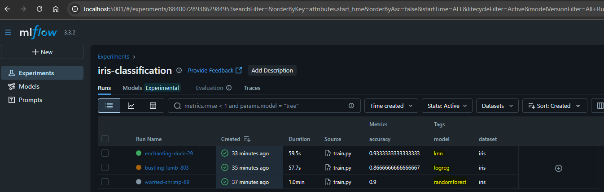
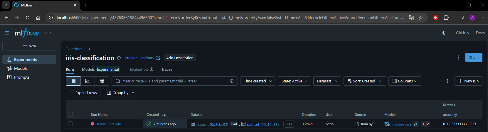
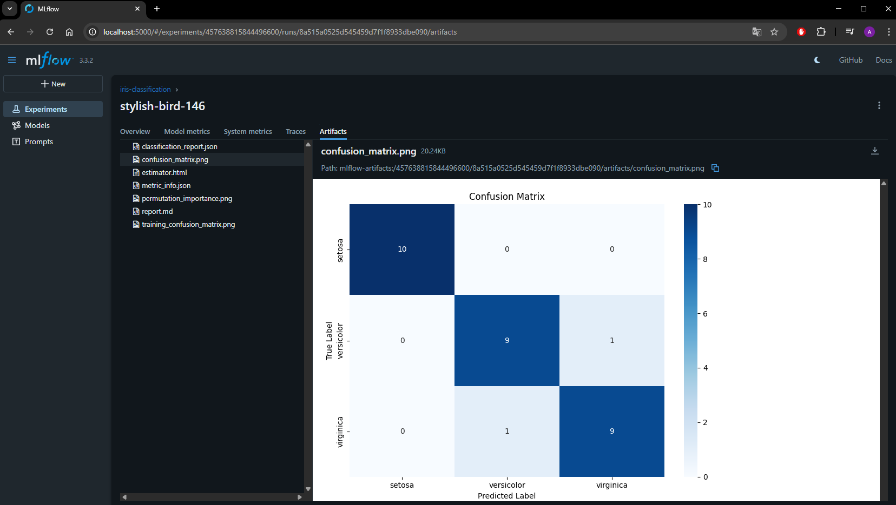
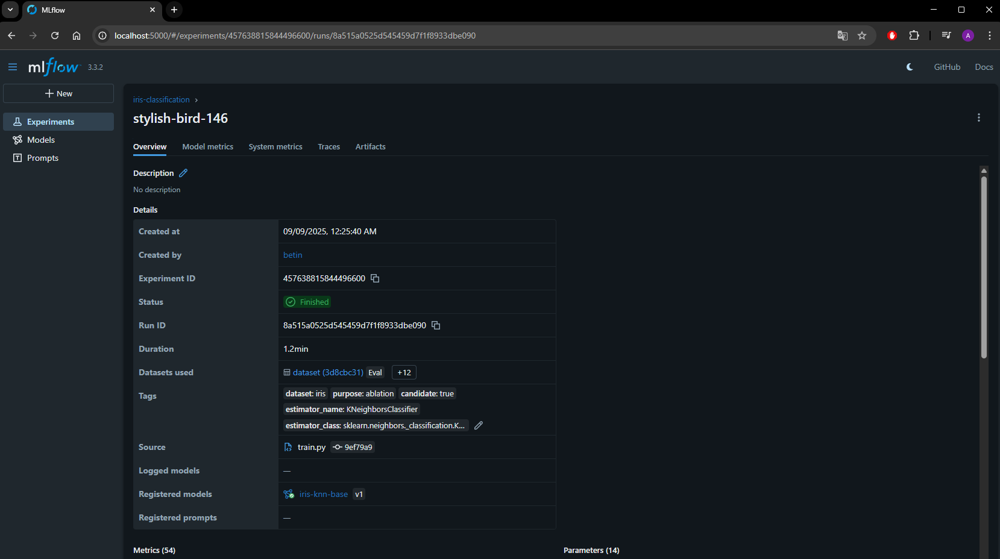
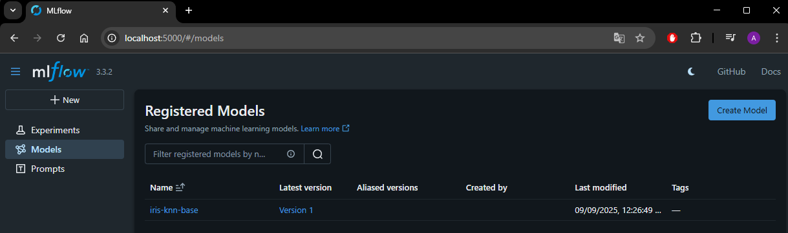
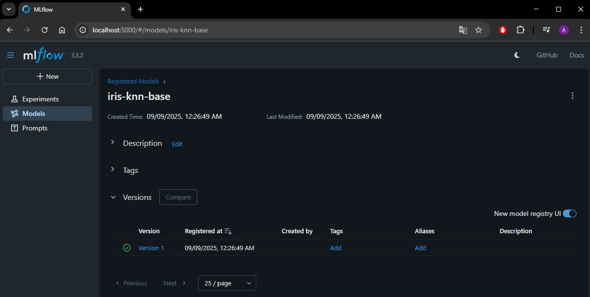

# mlflow-iris

## Установка среды
#### 1. Комманда установки venv
_python -m venv env_
#### 2. Запуск venv
_source env/Scripts/activate_
#### 3. Установка пакетов
_pip install -r requirements.txt_
## Установка MLflow
#### 1. Сборка докера
_docker build -t mlflow-server ._
#### 2. Запуск докера
_docker run -p 5001:5001  mlflow-server_
## Примеры использования:
---
#### Обучение с кастомными параметрами
##### Параметры запуска
- model[logreg|randomforest|knn] Str
- scaler[standard|minmax|none] Str
- features[base|scaled|poly] Str
- seed Int
##### Пример комманды запуска
_python src/train.py --model randomforest --scaler standard --features base --seed 45_

## Сравнение моделей logreg|randomforest|knn:
---
Точность предсказаний лучше у модели knn (0.9333).

## Скрины эксперимента в MLflow:
---

